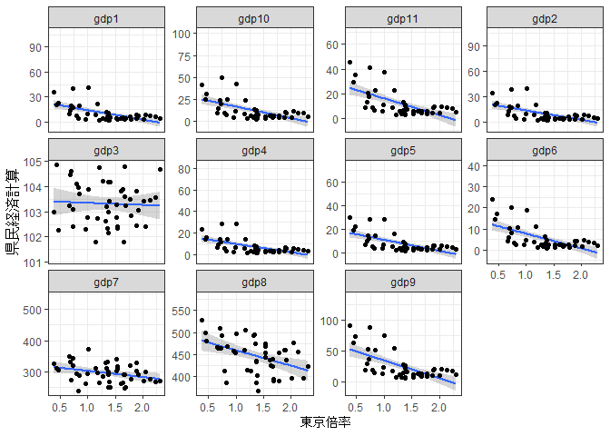

<!-- README.md is generated from README.Rmd. Please edit that file -->

# nhkcovid

<!-- badges: start -->

<!-- badges: end -->

The goal of nhkcovid is to …

## Installation

You can install the development version of nhkcovid from
[GitHub](https://github.com/) with:

``` r
# install.packages("devtools")
devtools::install_github("MTRBEKTCBT/nhkcovid")
```

## Example

This is a basic example which shows you how to solve a common problem:

``` r
library(nhkcovid)

nhkcovid_origin <-
read_data(
  .dir = here::here("inst/extdata"),
  .ptn = "nhk_news",
  .f = readr::read_csv
)
#> Rows: 44368 Columns: 8
#> ── Column specification ──────────────────────
#> Delimiter: ","
#> chr (3): 日付, 都道府県コード, 都道府県名
#> dbl (5): 各地の感染者数_1日ごとの発表数, 各地の感染者数_累計, 各地の死者数_1日ごとの発表数, 各地の死者数_累計, 各地の直近1週間の...
#> 
#> ℹ Use `spec()` to retrieve the full column specification for this data.
#> ℹ Specify the column types or set `show_col_types = FALSE` to quiet this message.
```

``` r
nhkcovid
#> # A tibble: 44,368 × 15
#>    date       rmean7 tokyo tokyo_r…¹ tokyo…² wday  pref_…³ jpref case_…⁴ case_…⁵
#>    <date>      <dbl> <dbl>     <dbl>   <dbl> <ord> <chr>   <chr>   <dbl>   <dbl>
#>  1 2020-01-16      0     0         0       0 木    01      北海…       0       0
#>  2 2020-01-17      0     0         0       0 金    01      北海…       0       0
#>  3 2020-01-18      0     0         0       0 土    01      北海…       0       0
#>  4 2020-01-19      0     0         0       0 日    01      北海…       0       0
#>  5 2020-01-20      0     0         0       0 月    01      北海…       0       0
#>  6 2020-01-21      0     0         0       0 火    01      北海…       0       0
#>  7 2020-01-22      0     0         0       0 水    01      北海…       0       0
#>  8 2020-01-23      0     0         0       0 木    01      北海…       0       0
#>  9 2020-01-24      0     1         0       0 金    01      北海…       0       0
#> 10 2020-01-25      0     1         0       0 土    01      北海…       0       0
#> # … with 44,358 more rows, 5 more variables: death_day <dbl>, death_cum <dbl>,
#> #   case_per_hund_thd_week <dbl>, prefecture <chr>, pref <chr>, and abbreviated
#> #   variable names ¹​tokyo_ratio, ²​tokyo_power, ³​pref_code, ⁴​case_day, ⁵​case_cum
#> # ℹ Use `print(n = ...)` to see more rows, and `colnames()` to see all variable names
```

``` r
gdp2018_full |>
  ggplot(aes(tokyo_power_cv, value)) +
  geom_smooth(method = "lm") +
  geom_point() +
  labs(
    x = "東京倍率",
    y = "県民経済計算"
  ) +
  scale_y_continuous(labels = scales::comma)+
  theme_bw() +
    facet_wrap(~gdp, scales = "free_y")
#> `geom_smooth()` using formula 'y ~ x'
#> Warning: Removed 11 rows containing non-finite values (stat_smooth).
#> Warning: Removed 11 rows containing missing values (geom_point).
```


